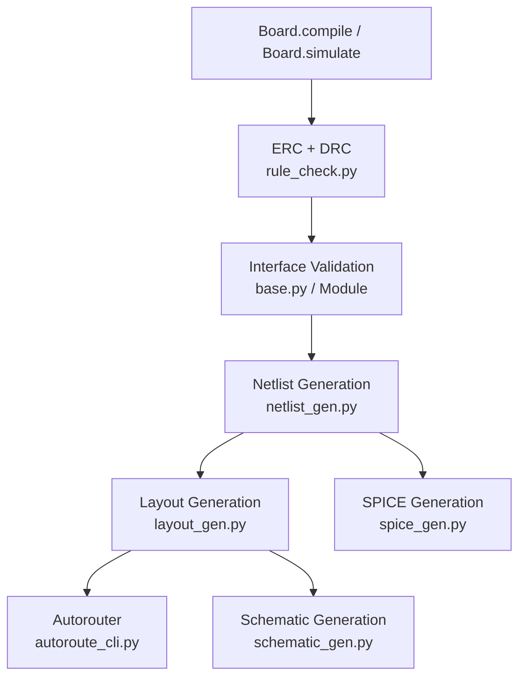
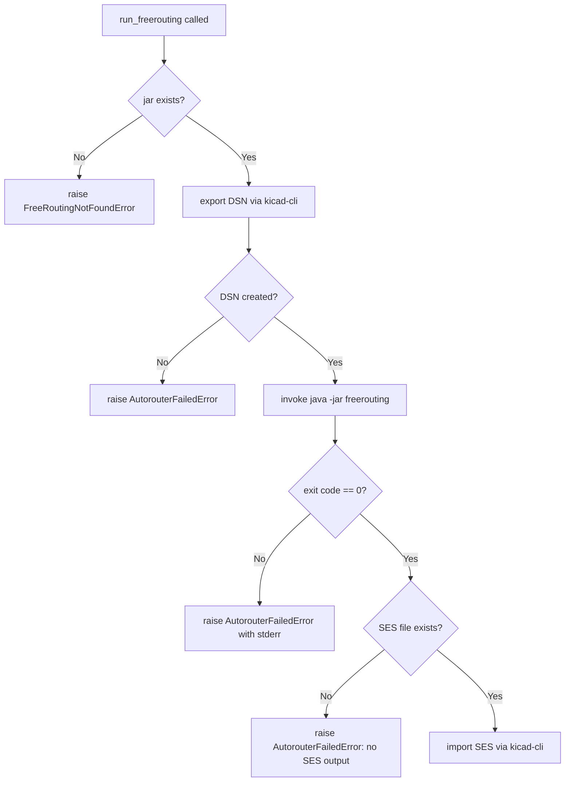

# Design Document: OpenHaC Production Readiness

## Overview

This document describes the technical design for five targeted production-readiness improvements to the OpenHaC PCB compiler framework. The changes transform the current prototype pipeline into one that produces real, usable KiCad schematics, routed PCBs, and valid SPICE netlists.

The five improvements are:

1. **Real KiCad Schematic Generation** — replace text annotations with proper S-expression symbol instances and wire geometry in `schematic_gen.py`
2. **FreeRouting Autorouter Integration** — replace the mock `autoroute_cli.py` with a real subprocess-based DSN/SES workflow
3. **Hardened Module Interface System** — add `declare_interface`/`expose_interface` to `Module` and validate connections at compile time
4. **Net-Level ERC Checks** — extend `rule_check.py` to detect floating nets, unconnected pins, and missing power flags
5. **Correct SPICE Ref Designator Assignment** — use `Part.ref_prefix` instead of fragile string matching in `spice_gen.py`

Each improvement is self-contained and can be developed and tested independently, though they share the same `Board.compile()` pipeline entry point.

---

## Architecture

The OpenHaC compiler pipeline follows a linear stage model:



The five improvements touch four distinct modules plus the `Module` base class:

| Module | Change |
|---|---|
| `openhac/core/base.py` | Add `declare_interface`, `expose_interface`, `required_interfaces`, deprecation warning |
| `openhac/compiler/schematic_gen.py` | Rewrite to emit real S-expression symbol instances and wires |
| `openhac/compiler/autoroute_cli.py` | Rewrite to invoke FreeRouting jar via subprocess |
| `openhac/compiler/rule_check.py` | Add floating-net, unconnected-pin, and power-flag checks |
| `openhac/compiler/spice_gen.py` | Replace string-matching heuristics with `Part.ref_prefix` |

`Board.compile()` in `board.py` requires minor additions to call interface validation before netlist generation.

---

## Components and Interfaces

### 1. Module Interface System (`openhac/core/base.py`)

**New methods on `Module`:**

```python
def declare_interface(self, name: str, *nets) -> Interface:
    """Register a named Interface as a required connection point."""

def expose_interface(self, name: str) -> Interface:
    """Return the named Interface, raising InterfaceNotFoundError if absent."""
```

**New attribute on `Module`:**
- `required_interfaces: dict[str, Interface]` — populated by `declare_interface` calls

**New exceptions:**
- `UnconnectedInterfaceError` — raised by `Board.compile()` when a required interface net has fewer than two pins
- `InterfaceNotFoundError` — raised by `expose_interface` when the name is not registered

**Deprecation hook on `Component.__getitem__`:**
When accessed from outside the owning module's `__init__` scope, emit `DeprecationWarning`. This is implemented by tracking the call stack frame to detect external callers.

**Backward compatibility:** All existing internal wiring (`self.mcu['2'] += self.vcc`) continues to work unchanged because `declare_interface` only adds to `required_interfaces`; it does not alter pin connectivity.

---

### 2. Schematic Generator (`openhac/compiler/schematic_gen.py`)

**New public function signature (unchanged):**
```python
def generate_schematic(output_path: str, board) -> None
```

**New exception:**
- `SchematicGenerationError` — raised when `default_circuit` is unavailable

**Internal helpers:**
- `_assign_grid_positions(parts) -> dict[Part, tuple[float, float]]` — assigns non-overlapping grid coordinates with ≥10 unit spacing
- `_emit_symbol_instance(f, part, x, y, uuid_str)` — writes one `(symbol ...)` S-expression block
- `_emit_wire(f, x1, y1, x2, y2)` — writes one `(wire (pts ...))` block
- `_emit_net_label(f, net_name, x, y)` — writes one `(label ...)` block for nets with >2 pins

**Layout strategy:** Parts are placed on a grid with 10-unit cell spacing. A simple row-major scan assigns positions left-to-right, top-to-bottom. Wire routing uses L-shaped (orthogonal) segments between pin stub endpoints.

---

### 3. Autorouter (`openhac/compiler/autoroute_cli.py`)

**New public function signature (unchanged):**
```python
def run_freerouting(pcb_path: str, freerouting_jar_path: str = None) -> None
```

**New exceptions:**
- `FreeRoutingNotFoundError` — jar not found at configured path
- `AutorouterFailedError` — non-zero exit code or missing SES output

**Workflow:**
1. Resolve jar path: parameter → `FREEROUTING_JAR` env var → raise `FreeRoutingNotFoundError`
2. Export DSN: invoke `kicad-cli pcb export-dsn` via subprocess
3. Run FreeRouting: `java -jar <jar> -input <dsn> -output <ses>`
4. Stream stdout in real time using `subprocess.Popen` with line-buffered output
5. Import SES: invoke `kicad-cli pcb import-ses` via subprocess
6. Verify SES file exists before import; raise `AutorouterFailedError` if absent

---

### 4. ERC Engine (`openhac/compiler/rule_check.py`)

**New exceptions:**
- `ERCFloatingNetError`
- `ERCUnconnectedPinError`
- `ERCMissingPowerFlagError`

**New public function (called from `run_erc`):**
```python
def _check_net_level(board) -> list[str]
```
Returns a list of violation strings. `run_erc` collects all violations from all checks before raising.

**Power-net prefix detection:** A net is considered a power net if its name (case-insensitive) starts with any of: `VCC`, `VIN`, `3V3`, `5V`, `GND`, `VBAT`, `VBUS`.

**No-connect exclusion:** SKiDL marks no-connect pins with `Pin.is_connected() == False` and `pin.net` being SKiDL's internal `NC` net. The check skips pins whose net is the SKiDL `NC` sentinel.

---

### 5. SPICE Generator (`openhac/compiler/spice_gen.py`)

**Ref-prefix resolution algorithm:**
```
ref = part.ref
prefix = part.ref_prefix or 'X'   # default to 'X' with warning
if not ref.upper().startswith(prefix.upper()):
    spice_id = prefix + ref
else:
    spice_id = ref
```

**Net name sanitization:** Replace ` `, `-`, `/` with `_`.

**No string matching** on `part.description`, `part.value`, or `part.name`.

---

## Data Models

### `Module` (updated)

```python
class Module:
    name: str
    components: list[Component]
    required_interfaces: dict[str, Interface]   # NEW
    width: float
    height: float
    placed_x: float | None
    placed_y: float | None
    max_current_draw_ma: float
    source_current_max_ma: float
```

### `Interface` (unchanged structure, new registration path)

```python
class Interface:
    name: str
    signals: list[Net]   # SKiDL Net objects
```

### ERC Violation Records

Violations are collected as plain strings and bundled into exception messages:

```
"Floating net: NET_NAME (1 pin)"
"Unconnected pin: U1 pin 3"
"Missing PWR_FLAG on power net: VCC"
```

### Schematic Placement Record (internal)

```python
@dataclass
class PartPlacement:
    part: Part
    x: float
    y: float
    uuid: str
```

### Autorouter Config (internal)

```python
@dataclass
class AutorouterConfig:
    jar_path: str
    pcb_path: str
    dsn_path: str
    ses_path: str
```

---

## Correctness Properties

*A property is a characteristic or behavior that should hold true across all valid executions of a system — essentially, a formal statement about what the system should do. Properties serve as the bridge between human-readable specifications and machine-verifiable correctness guarantees.*

---

### Property 1: Schematic file has correct S-expression header

*For any* board with a non-empty circuit, calling `generate_schematic` should produce a file whose first non-whitespace content is `(kicad_sch (version 20231120)`.

**Validates: Requirements 1.1**

---

### Property 2: Symbol instance count matches part count

*For any* circuit containing N parts, the generated `.kicad_sch` file should contain exactly N `(symbol ...)` S-expression instances, each with a `lib_id`, a `uuid`, and an `(at x y angle)` field.

**Validates: Requirements 1.2**

---

### Property 3: Symbol placements are non-overlapping and grid-aligned

*For any* set of parts placed by the schematic generator, no two `(at x y)` coordinates should be within 10 schematic units of each other, and all coordinates should be multiples of the grid unit.

**Validates: Requirements 1.3**

---

### Property 4: Shared-net pins produce wire segments

*For any* circuit where two or more pins share a net, the generated schematic should contain at least one `(wire ...)` S-expression for each such net connection.

**Validates: Requirements 1.4**

---

### Property 5: Multi-pin nets produce net labels

*For any* circuit, the number of `(label ...)` S-expressions in the output should equal the number of nets that have more than two connected pins.

**Validates: Requirements 1.5**

---

### Property 6: No bare text nodes in place of symbols

*For any* circuit, the generated `.kicad_sch` file should contain zero `(text ...)` nodes that serve as component placeholders (i.e., text content matching the pattern `"Auto-Placed Component: ..."`).

**Validates: Requirements 1.7**

---

### Property 7: Autorouter jar path resolution from environment

*For any* value of the `FREEROUTING_JAR` environment variable, calling `run_freerouting` without an explicit `freerouting_jar_path` argument should attempt to use the environment variable value as the jar path.

**Validates: Requirements 2.7**

---

### Property 8: declare_interface round-trip

*For any* module and any interface name with associated nets, calling `declare_interface(name, *nets)` and then `expose_interface(name)` should return an `Interface` whose `signals` list equals the nets passed to `declare_interface`.

**Validates: Requirements 3.1, 3.2, 3.5**

---

### Property 9: Unconnected required interface triggers compile error

*For any* board containing a module with a required interface whose nets have fewer than two pins attached, calling `Board.compile()` should raise `UnconnectedInterfaceError` that names the module, the interface, and the unconnected net.

**Validates: Requirements 3.3, 3.4**

---

### Property 10: Internal module wiring is unaffected by interface system

*For any* module that uses `declare_interface` and also performs internal pin wiring in `__init__`, the net connectivity established by the internal wiring should be identical before and after the `declare_interface` calls.

**Validates: Requirements 3.7**

---

### Property 11: ERC detects all floating nets

*For any* circuit containing nets with fewer than two connected pins, `run_erc` should raise `ERCFloatingNetError` and the error message should include every such net name — none should be silently omitted.

**Validates: Requirements 4.1, 4.4**

---

### Property 12: ERC detects all unconnected pins

*For any* circuit containing pins with no net assignment (excluding NC pins), `run_erc` should raise `ERCUnconnectedPinError` and the error message should include every such part reference and pin number.

**Validates: Requirements 4.2, 4.5, 4.9 (edge-case: NC pins excluded)**

---

### Property 13: ERC detects all power nets missing PWR_FLAG

*For any* circuit containing power nets (names starting with `VCC`, `VIN`, `3V3`, `5V`, `GND`, `VBAT`, `VBUS`) that have no `PWR_FLAG` symbol connected, `run_erc` should raise `ERCMissingPowerFlagError` listing all such net names.

**Validates: Requirements 4.3, 4.6**

---

### Property 14: ERC collects all violations before raising

*For any* circuit that has violations of multiple ERC rule types simultaneously, `run_erc` should raise a single exception (or a composite error) that contains violations from all applicable checks, not just the first check that fails.

**Validates: Requirements 4.7**

---

### Property 15: SPICE ref designator uses ref_prefix correctly

*For any* part, the SPICE identifier in the output `.cir` file should start with `part.ref_prefix` (or `'X'` if `ref_prefix` is None/empty), and `ref_prefix` should never be duplicated when `part.ref` already begins with it.

**Validates: Requirements 5.1, 5.2, 5.3, 5.4**

---

### Property 16: SPICE net name sanitization

*For any* net name containing spaces, hyphens, or forward slashes, the corresponding net identifier in the `.cir` output should have those characters replaced with underscores, with no other characters altered.

**Validates: Requirements 5.6**

---

### Property 17: SPICE output is a bijection over connected parts

*For any* circuit, the number of component lines in the `.cir` output should equal exactly the number of parts that have at least two connected pins — no duplicates and no omissions — and every component line should begin with a valid SPICE element identifier (a letter followed by alphanumeric characters).

**Validates: Requirements 5.7, 5.8**

---

## Error Handling

### Exception Hierarchy

```
OpenHaCError (base)
├── SchematicGenerationError          # schematic_gen.py
├── FreeRoutingNotFoundError          # autoroute_cli.py
├── AutorouterFailedError             # autoroute_cli.py
├── UnconnectedInterfaceError         # base.py / board.py
├── InterfaceNotFoundError            # base.py
├── ERCFloatingNetError               # rule_check.py
├── ERCUnconnectedPinError            # rule_check.py
├── ERCMissingPowerFlagError          # rule_check.py
└── ERCPowerBudgetError               # rule_check.py (existing)
```

All new exceptions carry structured data (net names, part refs, file paths) in their `args[0]` message string so that callers can display actionable diagnostics.

### Error Aggregation in ERC

`run_erc` collects violations into three lists before raising:

```python
floating_violations = []
unconnected_violations = []
power_flag_violations = []
# ... populate all three ...
errors = []
if floating_violations:
    errors.append(ERCFloatingNetError(...))
if unconnected_violations:
    errors.append(ERCUnconnectedPinError(...))
if power_flag_violations:
    errors.append(ERCMissingPowerFlagError(...))
if errors:
    raise ExceptionGroup("ERC failed", errors)  # Python 3.11+; fallback: raise first, attach rest
```

For Python < 3.11 compatibility, violations are concatenated into a single `ERCFloatingNetError` message if multiple types occur, or the first error type is raised with all violation details appended.

### Autorouter Error Flow



---

## Testing Strategy

### Dual Testing Approach

Both unit tests and property-based tests are required. They are complementary:

- **Unit tests** cover specific examples, integration points, error conditions, and the stdlib module updates.
- **Property tests** verify universal invariants across randomly generated inputs, catching edge cases that hand-written examples miss.

### Property-Based Testing

The property-based testing library for Python is **Hypothesis** (`pip install hypothesis`).

Each correctness property from the design document maps to exactly one Hypothesis `@given` test. Tests are configured to run a minimum of 100 examples per property.

Tag format in test comments:
```
# Feature: openhac-production-readiness, Property N: <property_text>
```

Example:

```python
from hypothesis import given, settings
from hypothesis import strategies as st

# Feature: openhac-production-readiness, Property 16: SPICE net name sanitization
@given(st.text(alphabet=st.characters(whitelist_categories=('L', 'N')), min_size=1))
@settings(max_examples=100)
def test_spice_net_sanitization(net_name_base):
    dirty = net_name_base + " -/suffix"
    result = sanitize_net_name(dirty)
    assert ' ' not in result
    assert '-' not in result
    assert '/' not in result
    assert '_' in result
```

### Unit Testing

Unit tests focus on:

- **Error conditions**: `SchematicGenerationError` when `default_circuit` is absent, `FreeRoutingNotFoundError` with missing jar, `InterfaceNotFoundError` on unknown interface name
- **Stdlib module updates**: verify `ESP32_WROOM`, `XT60_Input`, `LDO_5V` all populate `required_interfaces` after construction
- **Autorouter subprocess flow**: mock `subprocess.Popen` and `subprocess.run` to verify correct CLI commands are assembled
- **ERC power-budget preservation**: existing `ERCPowerBudgetError` still raised after net-level checks are added
- **NC pin exclusion**: circuit with SKiDL `NC` pins does not trigger `ERCUnconnectedPinError`
- **DeprecationWarning on external pin access**: use `warnings.catch_warnings` to assert warning is emitted

Avoid writing unit tests that duplicate what property tests already cover (e.g., don't write a unit test for "one specific net name is sanitized" when Property 16 already covers all net names via Hypothesis).

### Property Test to Design Property Mapping

| Test | Design Property | Hypothesis Strategy |
|---|---|---|
| `test_schematic_header` | Property 1 | Generate random part lists |
| `test_symbol_count` | Property 2 | `st.lists(part_strategy, min_size=1)` |
| `test_symbol_spacing` | Property 3 | `st.lists(part_strategy, min_size=2)` |
| `test_wire_segments_for_shared_nets` | Property 4 | Generate parts with shared nets |
| `test_label_count_matches_multi_pin_nets` | Property 5 | Generate circuits with varied net fan-out |
| `test_no_text_placeholder_nodes` | Property 6 | Any circuit |
| `test_jar_path_from_env` | Property 7 | `st.text()` for env var value |
| `test_declare_expose_roundtrip` | Property 8 | `st.text()` for names, `st.lists(net_strategy)` |
| `test_unconnected_interface_raises` | Property 9 | Generate modules with partially connected interfaces |
| `test_internal_wiring_unaffected` | Property 10 | Generate modules with internal wiring |
| `test_erc_floating_nets` | Property 11 | Generate circuits with floating nets |
| `test_erc_unconnected_pins` | Property 12 | Generate circuits with unconnected pins |
| `test_erc_missing_power_flag` | Property 13 | Generate circuits with power nets |
| `test_erc_all_violations_collected` | Property 14 | Generate circuits with multiple violation types |
| `test_spice_ref_prefix` | Property 15 | `st.text()` for ref/ref_prefix combinations |
| `test_spice_net_sanitization` | Property 16 | `st.text()` with special characters |
| `test_spice_bijection` | Property 17 | Generate circuits with varied connectivity |
