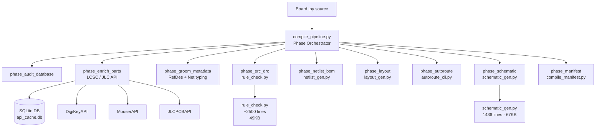

# OpenHaC Code Audit — May 2026

## Executive Summary

**340 tests pass · 121 tests fail · 1 skipped** (out of ~462 total).

The codebase is a sophisticated hardware-as-code compilation pipeline that translates Python board descriptions into KiCad schematics, netlists, BOM CSVs, and routed PCB files. It is architecturally ambitious and well-structured, but is carrying a significant regression load from an incomplete SKiDL→native migration that needs to be closed out before fabrication-mode builds are trusted.

---

## Architecture Overview



---

## Critical Issues (Blockers)

### BUG-001 — SKiDL `Net` leaking into native `Pin.__add__` (121 test failures)

**Root cause:** `openhac/core/part.py` line 65–66 — `Pin.__add__` only accepts `openhac.core.net.Net` or another `Pin`. Tests that were written against the old SKiDL API (or that co-create boards using SKiDL objects alongside native ones) pass `skidl.net.Net` objects, which the guard rejects:

```
TypeError: Cannot connect Pin to <class 'skidl.net.Net'>
```

This single root cause accounts for **~90+ failures** spanning `TestSCH005ErcHooks`, `TestREL001PassiveVoltageRatings`, `TestLIB005*`, `TestREL003*`, `test_skip_layout_compile`, `test_stress_satcom_docs_compile_offline`, etc.

**Fix options (pick one):**
- **Option A (preferred):** Update `Pin.__add__` to duck-type on `.pins` / `.add_pin` attributes rather than doing an `isinstance` check, making it interoperate with both.
- **Option B:** Purge remaining SKiDL `Net` usage from all test fixtures and board source files.
- **Option C:** Add a thin adapter shim that wraps `skidl.net.Net` → `openhac.core.net.Net` on first touch.

---

### BUG-002 — `netlist_gen` missing `generate_netlist` symbol

`test_bom_deterministic.py` monkeypatches `netlist_gen.generate_netlist` but the module doesn't expose that name — `generate_logic_and_bom` delegates to `default_circuit.generate_netlist(...)` directly (line 72), which is not a module-level attribute.

```python
# netlist_gen.py line 72
default_circuit.generate_netlist(netlist_path)  # method on circuit, not a module function
```

**Fix:** Expose a module-level wrapper `generate_netlist = default_circuit.generate_netlist` **or** change the test to monkeypatch the circuit method, not the module attribute.

---

### BUG-003 — `pcb_physics.py` is an empty stub

`openhac/compiler/pcb_physics.py` is **completely empty** (0 bytes). `compile_pipeline.py` imports `apply_physics_net_classes` from it at line 598:

```python
from openhac.compiler.pcb_physics import apply_physics_net_classes
```

This import is inside a `try/except` block in `phase_autoroute`, so it silently degrades — physics-based net-class application (trace width / impedance control via IPC-2152) is **not running** at all. This is a silent correctness failure in fabrication-mode builds.

---

### BUG-004 — Schematic wire/label test failures

`test_generate_schematic_wire_and_label_counts` and `test_schematic_geometry_round_trip_matches_parsed_file` fail. The error shows the label `"THREE"` is missing from schematic output. This likely relates to the grid-snap rounding introduced in `schematic_gen.py` (`_snap` to 1.27 mm / 50 mil) collapsing very short wire stubs to zero-length and swallowing adjacent labels — the same class of geometry regression from the prior conversation.

---

## Medium-Priority Issues

### CODE-001 — Global mutable state in schematic wire tracker

`schematic_gen.py` lines 611–624 use **module-level global sets**:

```python
_wire_endpoints: set[tuple[float, float]] = set()
_junction_candidates: set[tuple[float, float]] = set()
```

These are cleared via `_reset_junction_tracker()`, but if `generate_schematic` is called more than once in the same process (e.g., during test runs), state can leak between calls. This is particularly dangerous in the 88-test suite where multiple schematic generation tests run in sequence.

**Fix:** Convert these to local variables passed down through the call stack, or wrap them in a context-manager reset.

---

### CODE-002 — `APICache` SQLite connection not thread-safe

`vendor_apis.py` line 70:

```python
self.conn = sqlite3.connect(self.db_path, check_same_thread=False)
```

`check_same_thread=False` disables the thread guard but SQLite write operations are not serialized. Under concurrent enrichment (e.g., async enrichment workers), this will produce `database is locked` errors. The module also holds the connection open forever — there's no `close()` or context manager.

**Fix:** Use a threading `Lock` around all `conn.execute` + `conn.commit` pairs, or switch to `sqlite3.connect(..., timeout=30)` + WAL mode.

---

### CODE-003 — `datetime.now()` without timezone in `PartInfo`

Multiple `_parse_product` / `_parse_part` methods set:

```python
last_updated=datetime.now()  # naive datetime
```

But `_parse_smt_list_item` correctly uses:

```python
last_updated=datetime.now(timezone.utc)  # aware datetime
```

This inconsistency will cause comparison failures if timestamps are ever compared. `hashlib` is also imported twice in `vendor_apis.py` (top-level and again inside `_make_key`).

---

### CODE-004 — `phase_audit_database` runs before `enrich_metrics` is initialized

In `compile_pipeline.py`, `DEFAULT_COMPILE_PHASES` runs `phase_audit_database` first (line 826), which writes to `state.enrich_metrics["poisoned_parts"]` (line 192). But `enrich_metrics` is initialized as `{}` (an empty dict, line 48), so the write is safe — **however** `phase_enrich_parts` reads:

```python
is_poisoned = gn in state.enrich_metrics.get("poisoned_parts", [])
```

If `phase_audit_database` raises an exception and is silently caught, `poisoned_parts` will never be set and re-enrichment will be silently skipped. Consider using a `dataclass field(default_factory=lambda: {"poisoned_parts": []})` to make the contract explicit.

---

### CODE-005 — `phase_fixup_power_flags` runs after `phase_groom_metadata` mutates the circuit

`phase_fixup_power_flags` (line 376) calls `get_default_circuit()` and injects `PWR_FLAG` components by constructing `Component("PWR_FLAG", ...)`. If `phase_groom_metadata` already categorized nets and assigned RefDes, these late-injected components won't be groomed and their `_openhac_net_type` won't be set. They'll appear with no RefDes in the BOM.

---

### CODE-006 — BFS in `_assign_positions_grouped_by_module` uses a list as a queue (O(n²))

`schematic_gen.py` line 202:

```python
queue = [(p, 0) for p in sources]
...
curr, r = queue.pop(0)   # O(n) per iteration
```

`list.pop(0)` is O(n). For boards with many components, this degrades to O(n²). Use `collections.deque` instead.

---

### CODE-007 — `_emit_symbol_instance` writes `"Reference"` property twice

`schematic_gen.py` lines 671–691: The function writes a `(property "Reference" ...)` block at line 671 and then **again** at line 689. KiCad accepts this but it creates duplicate properties in the S-expression file, inflating file size and potentially confusing downstream parsers.

---

### CODE-008 — `RateLimiter` is not thread-safe

`vendor_apis.py` lines 264–281: `self.calls` is a plain list mutated without locking. Under concurrent API calls, two threads can both pass the `len(self.calls) >= self.max_calls` check simultaneously, causing double-rate-limit violations.

---

## Low-Priority / Style Issues

| ID | File | Line | Issue |
|----|------|------|-------|
| STYLE-001 | `compile_pipeline.py` | 57 | `getattr(self, "bbox_padding_mm", 0.5)` always returns `self.bbox_padding_mm` (it's a dataclass field); the `getattr` is redundant |
| STYLE-002 | `netlist_gen.py` | 89 | `natural_key(p.refdes)` — `p.refdes` can be `None` for parts that failed grooming; add a `or ""` guard |
| STYLE-003 | `compile_pipeline.py` | 183–183 | `if first_comp: break` on one line makes the loop body hard to read |
| STYLE-004 | `schematic_gen.py` | 431 | `'switch': _fuse_graphic()` — switch uses fuse graphic as a placeholder; add a `# TODO` comment |
| STYLE-005 | `vendor_apis.py` | 88 | `import hashlib` at top of file, then again inside `_make_key` at line 88 — redundant import |
| STYLE-006 | `net.py` | 138 | Bottom-of-file import `from openhac.core.part import Pin` — this works but is a circular import resolved by ordering; a `TYPE_CHECKING` guard would be cleaner |
| STYLE-007 | `compile_pipeline.py` | 336 | `f"Groomed: {c.generic_name} -> {p.refdes}"` uses f-string; rest of file uses `%`-style logging; inconsistent |

---

## Positive Observations

- **Phase architecture is solid.** `DEFAULT_COMPILE_PHASES` as an ordered tuple of callables is clean, testable, and extensible. The repair loop scaffold is well-thought-out.
- **Deterministic UUID generation** via `uuid.uuid5` in `schematic_gen.py` is correct and important for repeatable artifact diffs.
- **Vendor API fallback chain** (SMT → legacy → jlcsearch) with per-vendor cool-off blocking is production-quality.
- **50-mil grid snapping** throughout schematic generation is correct for KiCad compatibility.
- **Broad test coverage** — 88 test files covering edge cases like FreeRouting deadlocks, BOM determinism, routing quality thresholds, and fabrication gates.

---

## Recommended Fix Priority

| Priority | ID | Effort | Impact |
|----------|-----|--------|--------|
| 🔴 P0 | BUG-001 | Medium | Unblocks ~90 test failures |
| 🔴 P0 | BUG-002 | Trivial | Fixes BOM determinism test |
| 🔴 P0 | BUG-003 | High | Restores IPC-2152 physics constraints |
| 🟠 P1 | BUG-004 | Medium | Fixes schematic geometry regressions |
| 🟠 P1 | CODE-001 | Small | Fixes schematic state leakage in test runs |
| 🟡 P2 | CODE-002 | Small | Prevents DB lock under concurrent enrichment |
| 🟡 P2 | CODE-007 | Trivial | Eliminates duplicate KiCad properties |
| 🟢 P3 | CODE-003–006, STYLE-* | Trivial–Small | Polish |
