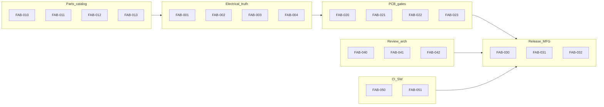

# OpenHaC — Fabrication Readiness Specification (Phase-2)

**Purpose:** Normative contract for an honest **code → PCB / fab package** path: either emit audited Gerbers + release artifacts with electrical parity, or **exit non-zero** with failures recorded on the compile manifest.

**Audience:** Core maintainers and contributors implementing Phase-2 gates.

**Status:** Normative contract for Phase-2. Progress tracked in [IMPLEMENTATION_STATUS.md](./IMPLEMENTATION_STATUS.md) (Phase-2 table — **20/20 Done** as of implementation landing). Software proof matrix: [PRODUCTION_VALIDATION.md](./PRODUCTION_VALIDATION.md).

**Relationship to Phase-1:** Phase-1 IDs in [PRODUCTION_READINESS_SPEC.md](./PRODUCTION_READINESS_SPEC.md) remain **closed**. This document does **not** reopen them. Phase-2 IDs use the `FAB-*` prefix.

**Product scope:** Capability tiers and non-goals: [SCOPE.md](./SCOPE.md). Advanced board capabilities (route reliability, API libs, BGA/HS/RF policy): [ADVANCED_BOARD_CAPABILITIES_SPEC.md](./ADVANCED_BOARD_CAPABILITIES_SPEC.md) (**ABC-***).

---

## Honest claim

For **supported part classes** and **supported board classes** (ordinary digital + power layouts that fit fab-profile geometry and do not require BGA escape / impedance-controlled HS / RF sign-off):

> `openhac compile … --production` with `compile_goal=fabrication` either produces a release zip (and subsequent `openhac export fab` Gerbers/drill/pos) with audited pin/pad/net parity, **or** fails loudly with a non-zero CLI exit and manifestable gate failures.

OpenHaC does **not** claim that autorouting alone yields production-ready high-speed, RF, or dense-fanout copper. See [SCOPE.md](./SCOPE.md) non-goals and **PCB-007**.

---

## Modes and severity

| Mode | Intent |
|------|--------|
| **handoff** | Reviewable KiCad artifacts; may warn and continue on some gaps. |
| **fabrication** | Fail-closed gates for pins, pads, footprints, routing completeness, PCB DRC, offline catalog, verified parts. |
| **`--production`** (CLI) | Must imply the full fab gate set (see **FAB-030**). |

| Severity | Meaning |
|----------|---------|
| **P0** | Silent wrong copper / wrong pins, or blocks honest “fab from code” claims |
| **P1** | Blocks typical fab workflow or CI confidence |
| **P2** | Important polish / advanced boards |
| **P3** | Process or long-tail |

Each requirement includes: **problem**, **current state**, **target state**, **acceptance criteria**, and **approach** (modules to change).

---

## Default policy matrix

Target behavior after Phase-2 (implement against this table).

| Policy | handoff | fabrication | `--production` (target) |
|--------|---------|-------------|-------------------------|
| Invented / generic pins | Allowed with watermark / warning | **Refuse** | Same as fabrication |
| Implicit named pins | ON unless denied | OFF unless explicitly enabled | OFF |
| Pad↔pin mismatch | **Warning** (not debug) | **Hard fail** | Hard fail |
| Missing footprint | Omit + list on manifest | **Hard fail** at place | Hard fail |
| Network enrich / JIT fetch | Allowed unless `OPENHAC_NO_NETWORK` | **Denied** (offline catalog) | Denied |
| Synthetic / low-confidence parts | Warn | **Hard fail** | Hard fail (`--require-verified-parts`) |
| Minimal / silent autoroute fallback | Allowed with disclaimer | **Forbidden** as success | Forbidden |
| Unrouted nets | Warn | **Hard fail** unless policy documents intentional NC | Hard fail |
| KiCad PCB DRC | Optional | **Required**, zero errors | Required |
| `.kicad_sch` export | Optional (CLI may still default on until **FAB-040**) | Optional; prefer `--no-schematic`. EE stamp path is **`--schematic-signoff`** ([SCHEMATIC_SIGN_OFF_SPEC.md](./SCHEMATIC_SIGN_OFF_SPEC.md)), not fabrication. | Prefer off unless `--schematic-signoff` |
| `--zip-release` with omitted parts | Warn | **Refuse** | Refuse |

---

## Golden commands (target recipe)

Use after Phase-2 gates land. Flags that do not yet imply the full matrix are marked *(to implement via FAB-030)*.

```bash
# Offline, fail-closed compile (no schematic drawing)
OPENHAC_NO_NETWORK=1 openhac compile board.py \
  --name proj \
  --production \
  --compile-goal fabrication \
  --strict-footprint-pads \
  --require-verified-parts \
  --no-schematic \
  -o dist/proj \
  --zip-release \
  --release-tag v0.1.0

# Fab outputs from the placed/routed board
openhac export fab dist/proj/proj.kicad_pcb -o dist/proj/fab --zip
```

Optional human review (connectivity, not copper aesthetics):

```bash
openhac compile board.py --name proj -o dist/proj --webview --no-schematic
# or: board.export_webview("dist/proj/proj.webview.html")
```

Headless logic-only CI (no pcbnew) remains valid with `--skip-layout` / `OPENHAC_SKIP_LAYOUT=1` and must **not** claim fabrication readiness.

---

## ID map



---

## A. Electrical truth

### FAB-001 — Refuse invented pins in fabrication

| Field | Content |
|-------|---------|
| **Severity** | P0 |
| **Problem** | Pin waterfall can invent generic `Pin_N` pins and swallow invalid `pinout_json`, producing plausible wrong connectivity. |
| **Current state** | [`openhac/core/pin_resolution.py`](../../openhac/core/pin_resolution.py): explicit → JSON → package template → `generate_generic_pins`; bad JSON falls through via bare `except`. [`openhac/core/base.py`](../../openhac/core/base.py): implicit pins ON outside fabrication. |
| **Target state** | Under `compile_goal=fabrication`, missing/invalid pinout **fails**; never invent pins. Handoff may still use templates/generics with an explicit watermark on the part/BOM. |
| **Acceptance criteria** | Pytest: fabrication compile of a part with empty/corrupt `pinout_json` exits/raises; handoff may warn. No `Pin_N` invented pins appear on fab builds. |
| **Approach** | Harden `get_pins_from_data` / `Component` pin load; fail closed when `effective_compile_goal() == "fabrication"`. |

### FAB-002 — Pad↔pin parity (warn always, fail in fab)

| Field | Content |
|-------|---------|
| **Severity** | P0 |
| **Problem** | Pad mismatches during place are often `logger.debug`; strict check is opt-in. |
| **Current state** | [`pcb_placement.pin_pad_coverage_warnings`](../../openhac/compiler/pcb_placement.py); [`layout_gen.assert_footprint_pin_pad_or_raise`](../../openhac/compiler/layout_gen.py) via `Board.strict_footprint_pin_pad_match` / `OPENHAC_STRICT_FOOTPRINT_PIN_PAD`. |
| **Target state** | Always ≥ **warning**. Fabrication and `--strict-footprint-pads` / fab goal: **hard fail**. Restrict LED A/K↔1/2 aliasing to known diode/LED footprints. |
| **Acceptance criteria** | Pytest: mismatched pad name fails fab compile; handoff logs warning visible at default log level. |
| **Approach** | Raise log level in `place_circuit_on_board`; enable `assert_footprint_pin_pad_or_raise` when `compile_goal=fabrication`. |

### FAB-003 — Missing footprint blocks release

| Field | Content |
|-------|---------|
| **Severity** | P0 |
| **Problem** | Handoff can skip missing footprints → PCB missing parts while zip still ships. |
| **Current state** | Fabrication raises in placement; handoff skips. No authoritative **omitted refs** list blocking zip. |
| **Target state** | Manifest `omitted_footprint_refs[]`. Any non-empty list **blocks** `--zip-release` and `export fab` in fabrication (and under `--production` once **FAB-030** lands). |
| **Acceptance criteria** | Integration test: omit footprint → compile may continue in handoff with list; zip-release / fab export refuses when list non-empty and goal is fabrication. |
| **Approach** | Record omissions on `CompileState`; check in `release_bundle` / `export_fab` / `compile_manifest`. |

### FAB-004 — Single circuit source of truth (native)

| Field | Content |
|-------|---------|
| **Severity** | P0 |
| **Problem** | Dual native + residual SKiDL paths risk divergent ERC/netlist/PCB views. |
| **Current state** | [`rule_check.py`](../../openhac/compiler/rule_check.py) prefers native `openhac.core.circuit` with legacy dual-scan; SCOPE still describes SKiDL as primary. |
| **Target state** | Native `openhac.core.circuit` is the sole SoT for ERC, netlist, SPICE pin iteration, and PCB net assignment. SKiDL only behind an explicit legacy/dev opt-in (or removed). |
| **Acceptance criteria** | Docs (SCOPE) state native SoT; tests for ERC/netlist/PCB pad nets run without requiring SKiDL for the golden fab fixture; no silent dual-world merge of nets. |
| **Approach** | Finish migration in `rule_check`, `netlist_gen`, `spice_gen`, `pcb_placement`; update SCOPE. |

---

## B. Parts and network

### FAB-010 — Offline-by-default for fabrication / deterministic releases

| Field | Content |
|-------|---------|
| **Severity** | P0 |
| **Problem** | `network_allowed()` defaults to **allowed**, so release builds can silently depend on vendor APIs. |
| **Current state** | [`enrich.network_allowed`](../../openhac/database/enrich.py): blocked only by `OPENHAC_NO_NETWORK` or deterministic-without-`OPENHAC_ALLOW_NETWORK`. |
| **Target state** | `compile_goal=fabrication` ⇒ network denied unless explicitly overridden by a documented break-glass env (name it in manifest). CI pytest sets `OPENHAC_NO_NETWORK=1`. |
| **Acceptance criteria** | Fab compile with empty vendor keys and no network succeeds if catalog is local; attempting enrich over network in fab fails or is skipped with hard error when pinout missing (**FAB-001**). |
| **Approach** | Gate `network_allowed` (or callers) on `OPENHAC_COMPILE_GOAL`; document break-glass; CI env. |

### FAB-011 — Verified / non-synthetic parts gate

| Field | Content |
|-------|---------|
| **Severity** | P0 |
| **Problem** | Synthetic symbols and low-confidence JIT parts can reach copper. |
| **Current state** | `--require-verified-parts`, `--production` / LIB-004 watermarks, strict JIT flags exist but are not all mandatory under fab goal. |
| **Target state** | Fabrication requires verified catalog parts: reject `OpenHaC_WATERMARK=SYNTHETIC_*` and low/medium JIT unless explicit allow-risky (handoff only). |
| **Acceptance criteria** | Pytest: synthetic or low-confidence part fails fab compile; passes handoff with watermark. |
| **Approach** | Enforce in `phase_audit_database` / pinout coverage / CLI when `compile_goal=fabrication`. |

### FAB-012 — API cache hygiene

| Field | Content |
|-------|---------|
| **Severity** | P1 |
| **Problem** | `openhac/database/api_cache.db` (~1.7MB) is tracked in git; not gitignored (unlike primary DB patterns). |
| **Current state** | File is versioned; vendor JSON cache lives in-tree. |
| **Target state** | Untrack from git; gitignore; store under user/cache dir (XDG or `OPENHAC_API_CACHE_PATH`). Document empty/local cache for developers. |
| **Acceptance criteria** | `git check-ignore` succeeds for cache path; CI does not commit binary cache growth; unit tests use temp cache. |
| **Approach** | `.gitignore` + path resolution in `vendor_apis` / cache helpers; remove from index in implementing PR. |

### FAB-013 — Enrich failures on manifest (no silent skip)

| Field | Content |
|-------|---------|
| **Severity** | P0 |
| **Problem** | Enrich import failure can return silently; per-part errors only increment counters. |
| **Current state** | [`compile_pipeline.phase_enrich_parts`](../../openhac/compiler/compile_pipeline.py). |
| **Target state** | Manifest lists `enrich_failures[]` (generic_name, reason). Fabrication: any failure that leaves pinout/footprint unresolved **fails** the compile (**FAB-001**/**FAB-003**). |
| **Acceptance criteria** | Injected enrich error appears on manifest; fab compile exit code ≠ 0 when unresolved. |
| **Approach** | Record on `CompileState`; surface in `compile_manifest`; raise under fab goal. |

---

## C. PCB place, route, and DRC

### FAB-020 — Footprint count and net-assignment parity

| Field | Content |
|-------|---------|
| **Severity** | P0 |
| **Problem** | Without a golden parity check, missing footprints or wrong pad nets can ship. |
| **Current state** | Placement assigns pad nets; PCB-001/002 Phase-1 Done for basic behavior; no fab golden asserting N↔N. |
| **Target state** | For fab compiles: footprint count on `.kicad_pcb` equals placeable part count; every netted pin maps to a pad net matching the netlist. |
| **Acceptance criteria** | Golden pytest / CI script on a small board: assert counts and sample pad-net equality. |
| **Approach** | Extend `pcb_metrics` / placement post-check; add `tests/test_fab020_place_parity.py` (or CI helper). |

### FAB-021 — Routing completeness gate

| Field | Content |
|-------|---------|
| **Severity** | P0 |
| **Problem** | Handoff may accept minimal/fallback routing that looks “done.” |
| **Current state** | [`compile_pipeline`](../../openhac/compiler/compile_pipeline.py) already distinguishes fab vs handoff for autoroute in places; metrics in [`pcb_metrics.py`](../../openhac/compiler/pcb_metrics.py) are incomplete (no unrouted count). |
| **Target state** | Fabrication: unrouted connectivity **fails** (or require explicit `Board` allow-list of intentional open nets). Minimal router must not count as success in fab. Manifest records unrouted count / policy. |
| **Acceptance criteria** | Test: leave a net unroutable → fab fails; handoff warns. Manifest field present. |
| **Approach** | Compute unrouted after autoroute; gate in `phase_autoroute` / `phase_routing_metrics`. |

### FAB-022 — KiCad PCB DRC required in fabrication

| Field | Content |
|-------|---------|
| **Severity** | P0 |
| **Problem** | OpenHaC DRC is heuristic; KiCad PCB DRC is the authoritative clearance/drill gate. |
| **Current state** | [`kicad_pcb_drc.run_kicad_pcb_drc`](../../openhac/compiler/kicad_pcb_drc.py) exists and is documented as fab-oriented. |
| **Target state** | Fabrication always runs `kicad-cli pcb drc` with `--exit-code-violations`; write report artifact; fail on violations. Missing `kicad-cli` fails fab (not silent skip). |
| **Acceptance criteria** | CI fab golden fails if DRC injected; report path listed in manifest. |
| **Approach** | Wire `phase_kicad_pcb_drc` to require success when `compile_goal=fabrication`. |

### FAB-023 — Fail-closed exception policy on PCB path

| Field | Content |
|-------|---------|
| **Severity** | P1 |
| **Problem** | Broad `except Exception` / bare `except` (~hundreds of sites) can hide place/postprocess failures. |
| **Current state** | Hotspots: `pcb_postprocess.py`, `pcb_placement.py`, `compile_pipeline.py`, `rule_check.py`. |
| **Target state** | On PCB/layout/fab paths: catch only expected errors; unexpected → raise in fabrication; always `logger.exception` with context in handoff. |
| **Acceptance criteria** | Audit doc or test that fab mode does not swallow `LayoutGenerationError` / DRC failures; reduce bare `except: pass` on those paths. |
| **Approach** | Incremental cleanup of hotspots; prefer typed `OpenHaCError` subclasses. |

---

## D. Manufacturing and release

### FAB-030 — `--production` implies full fabrication gate set

| Field | Content |
|-------|---------|
| **Severity** | P0 |
| **Problem** | CLI `--production` today ≈ `--strict` (KiCad + JIT), not full fab gates. |
| **Current state** | [`cli.py`](../../openhac/cli.py) `--production` / `--compile-goal` / `--strict-footprint-pads` / `--require-verified-parts` are separate. |
| **Target state** | `--production` sets (unless explicitly overridden): `compile_goal=fabrication`, strict footprint pads, require verified parts, `OPENHAC_NO_NETWORK=1` for the run, schematic default off recommended. Document overrides. |
| **Acceptance criteria** | CLI test: `--production` alone enables fab goal + pad strict + verified + no-network env for the process; manifest `compile_env_flags` reflects them. |
| **Approach** | Expand `_cmd_compile` flag application; update CLI help and RELEASE_CHECKLIST. |

### FAB-031 — Gerber + drill + pos CI golden

| Field | Content |
|-------|---------|
| **Severity** | P1 |
| **Problem** | MFG-001 export exists; Phase-1 stretch for CI Gerber zip remains open as a gate. |
| **Current state** | `openhac export fab`; layout smoke exists; no blocking Gerber golden job. |
| **Target state** | CI produces a Gerber/drill/pos zip for the fab golden board and fails if export fails. |
| **Acceptance criteria** | Workflow artifact or script `scripts/ci_fab_gerber_golden.py` green on main; documented in RELEASE_CHECKLIST. |
| **Approach** | Add CI job after fab compile golden (**FAB-051**). |

### FAB-032 — Manifest audit schema for fabrication

| Field | Content |
|-------|---------|
| **Severity** | P1 |
| **Problem** | Manifest lacks a single fab audit block for omitted parts, enrich failures, pad warnings, unrouted nets, DRC, network policy, circuit backend. |
| **Current state** | Rich [`compile_manifest.py`](../../openhac/compiler/compile_manifest.py) with many keys; incomplete for Phase-2 gates. |
| **Target state** | Schema `openhac.fab_audit.v1` (or equivalent keys under `fab_audit`): `compile_goal`, `network_allowed`, `circuit_backend`, `omitted_footprint_refs`, `enrich_failures`, `pad_pin_warnings`, `unrouted_net_count`, `kicad_pcb_drc` summary, `gates_passed`. |
| **Acceptance criteria** | Snapshot test of fab_audit keys on golden compile; RELEASE_CHECKLIST requires reviewing the block. |
| **Approach** | Extend `write_compile_manifest` / CompileState fields. |

---

## E. Review architecture

### FAB-040 — Schematic export optional on the fabrication path

| Field | Content |
|-------|---------|
| **Severity** | P1 |
| **Problem** | Algorithmic `.kicad_sch` drawing is a regression magnet and is not the **compile** electrical SoT. |
| **Current state** | `--production` defaults schematic off; API `Board.compile(export_schematic=False)`. |
| **Target state** | Fabrication / `--production` may omit the drawing. EE-stamped schematic review is a **separate** gate set: [SCHEMATIC_SIGN_OFF_SPEC.md](./SCHEMATIC_SIGN_OFF_SPEC.md) (`--schematic-signoff`, **SSO-***). FAB-040 does **not** forbid that path. |
| **Acceptance criteria** | CI fab path may use `--no-schematic`; `--schematic-signoff` still forces export + KiCad ERC. SCOPE states graph = compile SoT and `.kicad_sch` = stamp artifact under SSO. |
| **Approach** | Keep fab default off; SSO implementation lives in `openhac/schematic/`. |

### FAB-041 — Webview + IR as primary human review

| Field | Content |
|-------|---------|
| **Severity** | P1 |
| **Problem** | Engineers need hierarchical connectivity review without relying on auto-drawn schematics. |
| **Current state** | [`Board.export_webview`](../../openhac/core/board.py), [`openhac/webview/`](../../openhac/webview/), IR export, CLI `--webview`. |
| **Target state** | Documented primary review path: IR/manifest + interactive webview. Golden smoke for webview export in CI (no KiCad required). |
| **Acceptance criteria** | USER_GUIDE / SCOPE point to webview; `tests/test_webview_export.py` (or CI) covers export non-empty HTML. |
| **Approach** | Docs + keep exporter maintained; optional `--webview` on fab recipe as review step. |

### FAB-042 — Stable public API boundary

| Field | Content |
|-------|---------|
| **Severity** | P1 |
| **Problem** | Alpha package has no clear stable vs internal surface; phase list reorder can break consumers. |
| **Current state** | Public use is de-facto `openhac.core` + CLI; `compiler/*` fluid. |
| **Target state** | Document stable API: `openhac.core` (`Board`, `Module`, `Component`, `Net`, …) + `openhac` CLI. Mark `openhac.compiler` internal. Manifest records `compile_pipeline_phases` + schema version for phase list. |
| **Acceptance criteria** | Short **API stability** section in USER_GUIDE or API_REFERENCE; manifest includes phase list version key. |
| **Approach** | Docs first; optional `__all__` on `openhac.core`; avoid breaking CLI flags without CHANGELOG. |

---

## F. CI and software quality

### FAB-050 — CI matrix: no-network, mypy, coverage

| Field | Content |
|-------|---------|
| **Severity** | P1 |
| **Problem** | CI runs ruff + pytest; mypy/coverage unused; network not forced off; docs historically claimed layout-smoke `continue-on-error` while workflow may already block. |
| **Current state** | [`.github/workflows/ci.yml`](../../.github/workflows/ci.yml); mypy in `pyproject.toml` optional. |
| **Target state** | Pytest job: `OPENHAC_NO_NETWORK=1`. Add mypy on `openhac/core` (then widen). Coverage threshold on `openhac/core` + pin_resolution + pcb_placement (start modest). Align IMPLEMENTATION_STATUS / docs with actual layout-smoke policy. |
| **Acceptance criteria** | PR red on mypy/coverage fail; pytest env has no-network; doc strings match workflow. |
| **Approach** | Edit `ci.yml`; add `scripts/` or pytest config; fix stale SW-006 note if needed. |

### FAB-051 — Fabrication golden board job

| Field | Content |
|-------|---------|
| **Severity** | P1 |
| **Problem** | No single blocking job that runs full fab goal → place → route → PCB DRC → Gerbers. |
| **Current state** | `kicad-layout-smoke` / `scripts/ci_full_compile_smoke.py`; schematic ERC golden separate. |
| **Target state** | Dedicated job (or extended smoke) using a small JLC-friendly fixture under fab goal with offline catalog: compile → DRC → `export fab`. Blocks merge on failure. |
| **Acceptance criteria** | Script + workflow documented; uses `--compile-goal fabrication` (and production flags once **FAB-030** lands). |
| **Approach** | `scripts/ci_fab_golden.py` + workflow job; fixture board in `examples/` or `tests/fixtures/`. |

---

## Phase-3 / non-goals (acknowledged, not Phase-2 IDs)

These are **out of Phase-2** so they are not silently dropped:

| Topic | Notes |
|-------|--------|
| Hermetic pip-installable hardware modules | Ecosystem “pip for hardware” — see `openhac_v2_architecture_roadmap.md` |
| Split packages (`openhac-kicad-bridge`, autorouter plugin, docs package) | Post-IR backend split |
| Release signing / immutable approval workflow | Stretch beyond MFG-005 / STR-002 |
| In-tool SI/PI solver | SCOPE non-goal |
| Multi-sheet “pretty” schematic polish | Superseded by **FAB-040** / **FAB-041** |
| Automated BGA / dense fanout | SCOPE **PCB-008** |
| Certified mains / creepage | SCOPE **REL-002** |

---

## Implementation order (recommended)

1. **FAB-001, FAB-002, FAB-003, FAB-010, FAB-011, FAB-013** — fail closed on pins/pads/parts/network/enrich  
2. **FAB-012, FAB-032, FAB-030** — cache hygiene, manifest, CLI production semantics  
3. **FAB-020, FAB-021, FAB-022, FAB-023** — PCB parity / route / DRC / exceptions  
4. **FAB-040, FAB-041, FAB-042, FAB-004** — review SoT + native circuit finish  
5. **FAB-050, FAB-051, FAB-031** — CI depth + Gerber golden  

---

## Doc maintenance

When closing an ID: update the Phase-2 table in [IMPLEMENTATION_STATUS.md](./IMPLEMENTATION_STATUS.md) to **Done** with a short note (module + test). Do not mark Done without acceptance criteria met.
