# OpenHaC — Schematic Sign-Off Specification (SSO)

**Purpose:** Normative contract for an honest **code → KiCad schematic** path that an electrical engineer can open, ERC, and stamp. Either emit a `.kicad_sch` that is electrically isomorphic to the native circuit graph with library-backed (or pinout-synthesized) symbols and **zero KiCad ERC errors**, or **exit non-zero**.

**Audience:** Core maintainers implementing schematic generation and CI goldens.

**Status:** Normative. Progress tracked in [IMPLEMENTATION_STATUS.md](./IMPLEMENTATION_STATUS.md) (SSO table).

**Relationship:** Phase-1 **SCH-001…005** remain **closed**. Phase-2 **FAB-*** remain closed. This document uses the **`SSO-*`** prefix. It does **not** reopen SCH/FAB acceptance. **FAB-040** still allows fabrication compiles to omit a drawing; **SSO** is an additive `schematic_signoff` gate set.

**Product scope:** [SCOPE.md](./SCOPE.md).

---

## Honest claim

When `Board.schematic_signoff` is true (CLI `--schematic-signoff`):

> Compile either writes a KiCad schematic an EE can open, ERC, and stamp — electrically isomorphic to the native graph, symbols from libraries or pinout records, zero KiCad ERC errors — or fails with a non-zero CLI exit.

OpenHaC does **not** claim IEEE/IEC drafting beauty for every IC, SI/EMC sign-off, or that a generic box symbol is datasheet artwork. It **does** claim: correct nets, correct pin numbers and electrical types from data, power-port pin names equal to rail names, no-connect markers on unused pins, and KiCad ERC clean on golden boards.

Python `Board` remains the **authoring** source of truth. The native circuit graph remains the **compile** source of truth. The generated `.kicad_sch` is the **EE review/stamp** artifact. PCB placement continues to come from the graph (fab path unchanged). v1 does **not** make “Update PCB from schematic” the fabrication path.

---

## Modes and severity

| Mode | Intent |
|------|--------|
| **handoff** (no SSO) | Optional `.kicad_sch`; may warn and continue on missing libraries (generic box). |
| **`schematic_signoff`** | Fail-closed symbol resolution, graph↔sch parity, NC markers, power ports, `kicad-cli sch erc` with zero errors. |
| **`--production` / fabrication** | Unchanged fab gates. Schematic still **off by default** (**FAB-040**). Combine with `--schematic-signoff` to require both. |

| Severity | Meaning |
|----------|---------|
| **P0** | Silent wrong nets / wrong power rails, or blocks the stamp claim |
| **P1** | Blocks typical EE review or CI confidence |
| **P2** | Docs / polish |

Each requirement includes: **problem**, **current state**, **target state**, **acceptance criteria**, and **approach**.

---

## Default policy matrix

| Policy | handoff | schematic_signoff | `--production` alone |
|--------|---------|-------------------|----------------------|
| `.kicad_sch` export | Optional (CLI default on unless `--no-schematic`) | **Required** | Off unless `OPENHAC_PRODUCTION_SCHEMATIC` or `--schematic-signoff` |
| KiCad `sch erc` | Optional (`--kicad-erc`) | **Required**, zero errors | Not implied |
| Missing KiCad/vendor symbol for R/C/L/D | Synthesize box | **Hard fail** if Device lib is on disk and part has no `kicad_symbol` | n/a |
| Missing symbol for IC/connector | Synthesize box from `pinout_json` | Synthesize box if pinout complete; else **fail** | n/a |
| Reuse `power:VCC` for a different rail | Forbidden | **Forbidden** | n/a |
| Graph↔sch isomorphism (incl. power) | Best-effort | **Hard fail** on mismatch | n/a |
| Hardcoded part graphics in compiler | **Forbidden** | **Forbidden** | n/a |

---

## Golden command

```bash
OPENHAC_NO_NETWORK=1 openhac compile board.py \
  --name proj \
  --schematic-signoff \
  --skip-layout \
  --no-route \
  -o dist/proj
```

Combined with fabrication:

```bash
OPENHAC_NO_NETWORK=1 openhac compile board.py \
  --name proj \
  --production \
  --schematic-signoff \
  -o dist/proj
```

(`--schematic-signoff` forces schematic export even when `--production` would omit it.)

---

## Architecture

```mermaid
flowchart TD
  py[Python Board]
  graph[Native circuit graph]
  resolve[SymbolResolver]
  ir[Schematic IR]
  emit[Single KiCad emitter]
  sch[".kicad_sch"]
  erc[kicad-cli sch erc]
  libs[KiCad Device/power plus JLC EasyEDA]
  pinout[pinout_json]
  synth[Generic box synthesizer]

  py --> graph
  graph --> resolve
  libs --> resolve
  pinout --> resolve
  resolve -->|lib_id found| ir
  resolve -->|no lib| synth
  synth --> ir
  ir --> emit
  emit --> sch
  sch --> erc
```

Implementation lives in `openhac/schematic/`. [schematic_gen.py](../../openhac/compiler/schematic_gen.py) is a compatibility shim. [schematic_writer.py](../../openhac/compiler/schematic_writer.py) must not emit a second, empty schematic.

### No hardcoded components

The compiler must not contain part-type graphics or part-type pin maps.

**Forbidden in Python:** `_resistor_graphic`, `_capacitor_graphic`, `_led_graphic`, MOSFET drawings, `Device:R`/`Device:C` switches in the emitter, `_detect_symbol_type`, keyword lists that assign TX/MISO to a symbol side, forcing every rail onto `power:VCC`.

**Allowed:**

- Instantiating a symbol named in part metadata (`kicad_symbol`, JLC lib_id).
- Scanning on-disk `power.kicad_sym` (or overlay JSON) for a symbol whose **pin name** equals the net (`GND`, `+3V3`, `VBUS`).
- A **generic** synthesizer that only knows pin records: `{num, name, type, unit?, side?}`. Output is a rectangle + pins. Electrical type comes from the record (default `unspecified` under sign-off). If `side` is absent: `power_in` on top, `power_out` and ground-class `power_in`/`passive` named GND/VSS on bottom, remaining pins left/right in **pin-number order**.
- Catalog overlays / DB rows that set `kicad_symbol: Device:R`. That is data, not compiler logic.

### Pinout schema (data, not code)

`pinout_json` is a list of objects:

| Field | Required | Meaning |
|-------|----------|---------|
| `num` | yes | Pin number as shown on the footprint / symbol |
| `name` | yes | Pin name |
| `type` | yes | KiCad electrical type (`passive`, `input`, `power_in`, `no_connect`, …) |
| `side` | no | `left` / `right` / `top` / `bottom` for the synthesizer only |
| `unit` | no | Integer unit (v1 emits unit 1; recorded for future multi-unit) |

The compiler does **not** infer `side` from “TX”, “MISO”, or similar name keywords.

---

## A. Electrical parity (SSO-001…005)

### SSO-001 — Graph pin-net isomorphism including power nets

| Field | Content |
|-------|---------|
| **Severity** | P0 |
| **Problem** | SCH-001 golden compared wire clusters but **skipped power nets**. EE stamp requires every graph net (including 3V3/GND) to appear as the same connectivity in KiCad. |
| **Current state** | `schematic_wire_endpoint_pairs` ignores `_is_power_net` names. |
| **Target state** | Parity checker: for every graph pin with a net, the generated schematic connects that ref+pin to a KiCad net of the same name (via wire, local/global/hier label, or power symbol whose **pin name** matches the rail). |
| **Acceptance criteria** | Pytest on a 3V3/GND + signal fixture; power nets included. |
| **Approach** | `openhac/schematic/parity.py` over schematic IR + parsed `.kicad_sch`. |

### SSO-002 — Instance rotation composed into pin world coordinates

| Field | Content |
|-------|---------|
| **Severity** | P0 |
| **Problem** | Passives rotated 90° still wire to unrotated pin offsets. |
| **Current state** | `_emit_symbol_instance` sets `rot`; `_pin_world_xy` ignores it. |
| **Target state** | World pin = origin + R(instance_rot) × library pin offset. |
| **Acceptance criteria** | Unit test: 90° instance; wire endpoint equals rotated library pin. |
| **Approach** | `layout.py` / `emit_kicad.py` share `rotate_offset`. |

### SSO-003 — Power port pin name equals net name

| Field | Content |
|-------|---------|
| **Severity** | P0 |
| **Problem** | Every non-GND rail instanced `power:VCC`. KiCad binds power nets to the **library pin name**, so 3V3/5V/VBUS can collapse onto VCC. |
| **Current state** | `_emit_power_symbol` uses `power:VCC` or `power:GND`. |
| **Target state** | Prefer KiCad `power:+3V3`, `power:GND`, `power:VBUS` by scanning `power.kicad_sym`. Else synthesize a one-pin power symbol whose pin name **is** the net. Never reuse `power:VCC` unless the net is `VCC`. |
| **Acceptance criteria** | Generated sch for net `3V3` contains no `lib_id "power:VCC"` for that rail; pin name is `3V3` or `+3V3`. |
| **Approach** | `resolve.py` power-symbol provider. |

### SSO-004 — Single schematic emitter

| Field | Content |
|-------|---------|
| **Severity** | P0 |
| **Problem** | `Circuit.generate_schematic()` uses a stub writer with empty wires. Compile uses `schematic_gen`. |
| **Current state** | [schematic_writer.py](../../openhac/compiler/schematic_writer.py) placeholder. |
| **Target state** | One emit path: `openhac.schematic.emit_kicad`. Circuit API and `phase_schematic` call it. |
| **Acceptance criteria** | `Circuit.generate_schematic` writes wires/labels; stub does not invent `Device:IC` with hidden pins. |
| **Approach** | Writer delegates; delete placeholder emit logic. |

### SSO-005 — No part-type graphics or keyword pin-side tables

| Field | Content |
|-------|---------|
| **Severity** | P0 |
| **Problem** | Compiler draws zig-zag resistors, LEDs, MOSFETs and bins IC pins by TX/MISO keywords. |
| **Current state** | `_resistor_graphic`, `_detect_symbol_type`, semantic left/right split in `write_generated_symbol_library`. |
| **Target state** | Those functions **gone**. Synthesizer is rectangle + pin records only. |
| **Acceptance criteria** | **SSO-042** grep/AST test. |
| **Approach** | Delete from `schematic_gen.py`; synth in `synth.py`. |

---

## B. Symbol resolution (SSO-010…019)

### SSO-010 — Ordered providers, fail-closed under sign-off

| Field | Content |
|-------|---------|
| **Severity** | P0 |
| **Problem** | `lib_id` guessing and synthetic boxes even when a real library symbol exists. |
| **Current state** | Mix of SKiDL lib nick, generated OpenHaC boxes, Device skip. |
| **Target state** | First hit wins: (1) explicit `kicad_symbol`, (2) downloaded JLC/EasyEDA symbol if LCSC id present, (3) KiCad search path by lib_id, (4) generic synthesizer from complete `pinout_json`. Under sign-off, R/C/L/D must resolve to a Device (or vendor) library symbol when those libs are on disk — do not synthesize a fake zigzag. ICs/connectors may synthesize a box. Fail if pinout incomplete (FAB-001). |
| **Acceptance criteria** | Unit tests for each provider; sign-off raises `SchematicGenerationError` on resistor without resolvable `Device:R` when Device lib exists. |
| **Approach** | `openhac/schematic/resolve.py`. |

### SSO-011 — Pin positions from resolved `.kicad_sym`

| Field | Content |
|-------|---------|
| **Severity** | P0 |
| **Problem** | Stub even/odd pin layout when a library exists. |
| **Current state** | `kicad_sym_pinpos.SymbolPinResolver` when libs found. |
| **Target state** | Wiring always uses resolved symbol pin `(at x y)`. Stub offsets only when `OPENHAC_SCHEMATIC_STUB_ONLY=1` (tests). |
| **Acceptance criteria** | Existing pinpos tests plus SSO-002. |
| **Approach** | Reuse `kicad_sym_pinpos`; apply rotation (SSO-002). |

### SSO-012…019 — Reserved

Stretch: multi-unit symbols, DeMorgan, overlay JSON `net → power lib_id` map beyond library scan. Not required for v1 Done.

---

## C. Power, NC, labels (SSO-020…029)

### SSO-020 — No-connect markers from pin type / unconnected pins

| Field | Content |
|-------|---------|
| **Severity** | P0 |
| **Problem** | `_emit_no_connect` only on multi-sheet when the net name is exactly `NC`. |
| **Target state** | Flat and hierarchical: emit KiCad `no_connect` for `type=no_connect`, `__NOCONNECT` / NC net, or pins with no net. |
| **Acceptance criteria** | Pytest: unused IC pin gets `(no_connect` in `.kicad_sch`. |
| **Approach** | IR `NoConnect` records in `emit_kicad.py`. |

### SSO-021 — `power:PWR_FLAG` on the sheet

| Field | Content |
|-------|---------|
| **Severity** | P1 |
| **Problem** | Native `Component("PWR_FLAG")` injected for ERC may never appear as a KiCad power flag. |
| **Target state** | Each categorized/declared power or GND net gets a `power:PWR_FLAG` instance on the sheet (in addition to rail ports). Graph-only injected flags need not be duplicated as `U?` symbols. |
| **Acceptance criteria** | Fixture with `3V3`/`GND` contains `lib_id "power:PWR_FLAG"`. |
| **Approach** | Emitter, not `phase_fixup_power_flags` alone. |

### SSO-022 — Fanout policy (no spaghetti)

| Field | Content |
|-------|---------|
| **Severity** | P1 |
| **Problem** | Spanning-tree L-wires across the sheet are unreadable. |
| **Target state** | Fanout ≥ 3: net labels (power already uses ports). Fanout 2: orthogonal wire if pins share a row/column after 50 mil snap; else labels. |
| **Acceptance criteria** | 3-pin signal net has labels and no requirement for a 3-segment spanning tree; 2-pin axis-aligned net has one wire. |
| **Approach** | `layout.py` connectivity pass. |

### SSO-023…029 — Reserved

Stretch: bus entry graphics for `NET[7..0]`. v1 may label bus nets as ordinary labels.

---

## D. IR, layout, hierarchy (SSO-030…039)

### SSO-030 — Hierarchical sheets with typed pins

| Field | Content |
|-------|---------|
| **Severity** | P1 |
| **Problem** | Hierarchical pins were hard-coded `passive`. |
| **Target state** | One sheet per `OpenHaC_SchSheet` / `OpenHaC_Module` when multi-sheet policy fires. Hierarchical pin electrical type from interface/net pin types (fallback `passive` if mixed/unknown). |
| **Acceptance criteria** | Existing multi-sheet tests plus a typed pin when all pins on the net share `input`/`output`. |
| **Approach** | `emit_kicad.py` sheet pass; `_want_multi_sheet` policy unchanged. |

### SSO-031 — Schematic IR then emit

| Field | Content |
|-------|---------|
| **Severity** | P1 |
| **Problem** | Geometry and file write can diverge (round-trip tests). |
| **Target state** | Dataclasses: placements, symbol instances, wires, labels, power ports, NC, sheets. Emit is a pure S-expression dump of IR. Title block: project name, rev, date, company from Board — **no** “Fabrication Ready - Automated Synthesis”. |
| **Acceptance criteria** | `schematic_geometry` / parsed file match IR wires and labels. |
| **Approach** | `openhac/schematic/ir.py`, `emit_kicad.py`. |

### SSO-032…039 — Reserved

Stretch: auto page size beyond A4, collision-free label placement solver.

---

## E. Gates and CI (SSO-040…050)

### SSO-040 — KiCad schematic ERC required under sign-off

| Field | Content |
|-------|---------|
| **Severity** | P0 |
| **Problem** | `--kicad-erc` is opt-in; production omits schematic. |
| **Target state** | `--schematic-signoff` sets `export_schematic=True` and `kicad_sch_erc=True`. Non-zero ERC errors fail compile. |
| **Acceptance criteria** | CLI/API test: sign-off without schematic export is rejected; ERC wrapper called. |
| **Approach** | `cli.py`, `Board.compile`, `phase_schematic`. |

### SSO-041 — Complex-board ERC golden

| Field | Content |
|-------|---------|
| **Severity** | P1 |
| **Problem** | CI golden is two resistors. |
| **Target state** | `scripts/ci_kicad_sch_erc_golden.py` compiles `examples/sso041_signoff_node.py` (multi-module Device R/C/LED, named 3V3/GND) with `--schematic-signoff --skip-layout --no-route` and asserts KiCad ERC `error_count == 0`. Two-resistor case remains as a smoke. RS-485 / ESP32-C3 nodes stay fabrication goldens until MCU/connector ERC is clean. **Sep 2026:** CI must use `examples/sso041_signoff_node.py`, not `complex_rs485_node.py`. |
| **Acceptance criteria** | Job `kicad-schematic-erc` runs the script; warnings allowed, errors not. |
| **Approach** | Extend the existing golden script + workflow. |

### SSO-042 — Regression: hardcoded graphics stay gone

| Field | Content |
|-------|---------|
| **Severity** | P1 |
| **Problem** | Graphics functions can creep back. |
| **Target state** | Pytest scans `openhac/` source for `_resistor_graphic`, `_capacitor_graphic`, `_led_graphic`, `_detect_symbol_type`. |
| **Acceptance criteria** | Test fails if those names reappear. |
| **Approach** | `tests/test_sso_no_hardcoded_graphics.py`. |

### SSO-050 — Docs: stamp artifact vs fab-without-drawing

| Field | Content |
|-------|---------|
| **Severity** | P2 |
| **Problem** | SCOPE says pretty schematics are not SoT; FAB-040 demotes drawings. |
| **Target state** | Native graph is compile SoT. When `schematic_signoff`, the stamped review artifact is `.kicad_sch`. Webview remains optional debug (**FAB-041**). FAB-040 still allows fab packages without a sheet. README states the SSO claim. |
| **Acceptance criteria** | SCOPE, FAB-040 note, IMPLEMENTATION_STATUS SSO table, README Outputs. |
| **Approach** | Docs only. |

---

## Non-goals (v1)

- Multi-unit DeMorgan / IEEE resistor drawing **inside** the synthesizer (use `Device:R` from KiCad).
- Automatic bus-entry graphics.
- Making KiCad schematic the PCB generation source.
- Hardcoded MCU pin banks or stdlib symbol drawings.
- EMC / SI / timing sign-off (unchanged SCOPE non-goals).

---

## ID map

```mermaid
flowchart LR
  subgraph parity [Parity]
    SSO001[SSO-001]
    SSO002[SSO-002]
    SSO003[SSO-003]
    SSO004[SSO-004]
    SSO005[SSO-005]
  end
  subgraph symbols [Symbols]
    SSO010[SSO-010]
    SSO011[SSO-011]
  end
  subgraph sheet [Sheet]
    SSO020[SSO-020]
    SSO021[SSO-021]
    SSO022[SSO-022]
    SSO030[SSO-030]
    SSO031[SSO-031]
  end
  subgraph ci [CI_docs]
    SSO040[SSO-040]
    SSO041[SSO-041]
    SSO042[SSO-042]
    SSO050[SSO-050]
  end
  symbols --> parity
  parity --> sheet
  sheet --> ci
```


